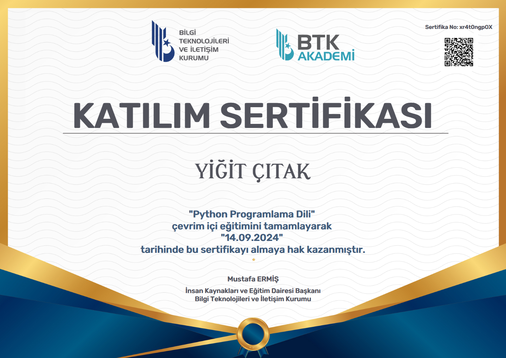

  

# 💫 Hakkımda:
Hobi olarak yazılım geliştiriyorum. 
Python ile GUI programlar yapıyorum. 
Yaptığım programları Linux tabanlı işletim sistemlerinde çalışacak şekilde yazıyorum. 

<a href="https://yigit-packages.netlify.app/">Yayınladığım paketler</a>  
Yaptığım programlar: 
  <a href="https://defter.netlify.app/">Defter</a>

# 💻 Teknoloji Yığını:
     

# 📊 GitHub İstatistikleri:
 
 

# 🎓 Sertifikaları:

  

## 🏆 GitHub Ödülleri

### 🔝 En Çok Katkıda Bulunan Depo

<!-- Proudly created with GPRM ( https://gprm.itsvg.in ) -->

