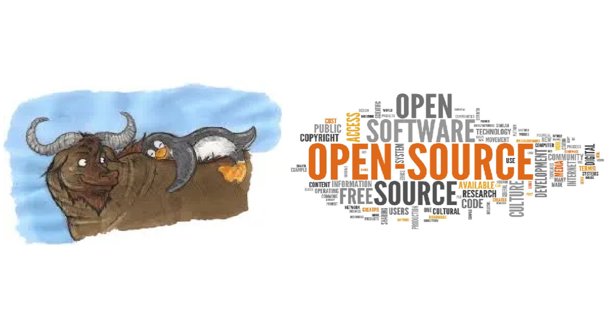

<h1 align="center">Hi 👋, I'm Yiğit çıtak</h1>
<h3 align="center">I'm interested in Linux tools, Desktop programs and web development.</h3>
<h3 align="center">𐱅𐰭𐰼𐰃:𐱅𐰇𐰼𐰜𐰇:𐰸𐰆𐰺𐰽𐰣</h3>
<h3 align="center"><a href="https://github.com/Yigit-2023">My old github account</a></h3>
<h3 align="center"><a href="https://yigit-packages.netlify.app/">My Packages</a></h3>

<h3 align="left">Languages and Tools:</h3>

        

